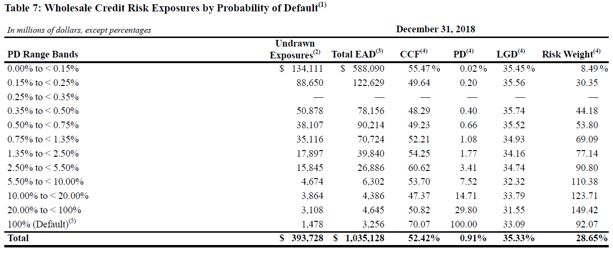

```{r setup, include=FALSE}
knitr::opts_chunk$set(echo      = FALSE, 
                      warning   = FALSE, 
                      error     = FALSE, 
                      tidy      = TRUE, 
                      tidy.opts = list(width.cutoff=50), 
                      collapse  = TRUE,
                      warning   = FALSE,
                      error     = FALSE,
                      message   = FALSE, 
                      comment   = "",
                      cache     = FALSE) 

rm(list = ls())
 

library(tidyverse)            ## Data manipulation, pipe operator
library(data.table)           ## Command to bind lists
library(ggridges)             ## Density ridges plot
library(stargazer)            ## Latex tables
library(lfe)                  ## High-dimensional fixed effects
library(gridExtra)            ## Create grid for plots and tables
library(cowplot)              ## Create grid for plots and tables
library(DescTools)            ## Command to winsorize variables
library(ggpubr)               ## More plots
#library(relaimpo)            ## Calculate relative importance measures

source("../../Auxiliar/Function.R") ## Capital requirements functions

```

```{r load data, include=TRUE}
load("../../Data/Datasets/Pillar3Data.Rda")
load("../../Data/Datasets/BankData.Rda")
load("../../Data/Datasets/CrossSectionDecomposition.Rda")
load("../../Data/Datasets/timedecomposition.Rda")
load("../../Data/Datasets/yeardecomposition.Rda")
```

## Motivation

- The regulation on bank capital requirements have evolved substantially since the first international standard, the 1988 Basel Accord. 

- At the heart of these changes is the link of capital charges to asset risk [@BCBS2017basel; @EBA2019policy].

- Basel II introduced the internal-ratings based (IRB) approach [@basel2004international].


## Motivation
Problems:

 - Linking capital charges to asset risks exacerbates the **procyclicality** of lending [@danielsson2001academic; @kashyap2004cyclical; @repullo2012procyclical; @behn2016procyclical].

 - The inherent flexibility of the IRB approach may allow for differences in capital requirements that do not reflect portfolio risk but rather modelling choices [@le2012revisiting; @mariathasan2014manipulation; @behn2016limits; @berg2017analysis; @ferribank].


## Contribution

- This paper contributes to understanding the cyclicality and variability of capital requirements. 

- I identify the effects of an unexplored feature of the IRB framework on capital requirements: 
  - Banks save capital requirements because mapping from probability of default (PD) to capital requirements is concave.

## Actual Capital Requirements

```{r parameters and data, echo=FALSE, include=FALSE}
set.seed(123)
LGD <- 1
M   <- 2.5
grid  <- seq(0.0001, 1, by=0.00001) 
data <- mapping_retail(grid,1,0.15,0.999)
PD.l <- 0.01
PD.h <- 0.15
PD.a <- (PD.l+PD.h)/2
PD.h2 <- 0.17
PD.h3 <- 0.16
PD.l3 <- 0.02
PD.a2 <- (PD.l+PD.h2)/2
K.l  <- as.numeric(mapping_retail(PD.l,1,0.15,0.999)["K"])
K.h  <- as.numeric(mapping_retail(PD.h,1,0.15,0.999)["K"])
K.a  <- as.numeric(mapping_retail(PD.a,1,0.15,0.999)["K"])
K.l3 <- as.numeric(mapping_retail(PD.l3,1,0.15,0.999)["K"])
K.h2 <- as.numeric(mapping_retail(PD.h2,1,0.15,0.999)["K"])
K.h3 <- as.numeric(mapping_retail(PD.h3,1,0.15,0.999)["K"])
K.a2  <- as.numeric(mapping_retail(PD.a2,1,0.15,0.999)["K"])
K.s  <- ((K.h-K.l)/(PD.h-PD.l))*PD.a+K.l-((K.h-K.l)/(PD.h-PD.l))*PD.l
K.s2 <- ((K.h2-K.l)/(PD.h2-PD.l))*PD.a2+K.l-((K.h2-K.l)/(PD.h2-PD.l))*PD.l
K.s3 <- ((K.h3-K.l3)/(PD.h3-PD.l3))*PD.a2+K.l3-((K.h3-K.l3)/(PD.h3-PD.l3))*PD.l3
aux.df <- data.frame(PD.l = PD.l, PD.h = PD.h, PD.a = PD.a, PD.l3 = PD.l3, PD.a2,
                     K.l = K.l, K.h = K.h, K.a = K.a, K.s = K.s, K.l3 = K.l3, K.h2 = K.h2, 
                     K.h3 = K.h3, K.s3 = K.s3, K.s2 = K.s2)
```


```{r, fig.height = 3, fig.width = 4,results="hide",out.width = "90%", fig.align = 'center', echo=FALSE, message=FALSE}


p <- ggplot(data = subset(data,subset = PD <0.2),
            mapping = aes(x = PD, y=K)) 
p + geom_line(alpha = 1) + 
  geom_segment(aes(x = PD.l, y = 0, xend = PD.l, yend = K.l), data = aux.df, linetype=3)+
  geom_segment(aes(x = PD.h, y = 0, xend = PD.h, yend = K.h), data = aux.df, linetype=3)+
  geom_segment(aes(x = PD.l, y = K.l, xend = PD.h, yend = K.h), data = aux.df, linetype=1)+
  geom_segment(aes(x = PD.a, y = K.s, xend = PD.a, yend = 0), data = aux.df, linetype=3)+
  geom_segment(aes(x = PD.a, y = K.s, xend = 0, yend = K.s), data = aux.df, linetype=5)+
  labs(x = "PD", 
         y = "Risk-weight") +
  theme_bw()+
  theme(axis.ticks = element_blank(),
        axis.line = element_line(),
        panel.grid = element_blank())+
  expand_limits(x = 0, y = 0)+
  scale_x_continuous("",breaks=c(PD.l,PD.a,PD.h,PD.h+0.045),labels=c("Low PD","Mean PD","High PD","PD"),expand = c(0, 0))+
  scale_y_continuous("",breaks=c(K.s,K.h+0.03),labels=c(expression(paste(RW^{a})),"RW"),expand = c(0, 0)) 

```

## Counterfactual Capital Requirements
```{r, fig.height = 3, fig.width = 4,results="hide",out.width = "90%", fig.align = 'center', echo=FALSE, message=FALSE}

p <- ggplot(data = subset(data,subset = PD <0.2),
            mapping = aes(x = PD, y=K)) 
p + geom_line(alpha = 1) + 
  geom_segment(aes(x = PD.l, y = 0, xend = PD.l, yend = K.l), data = aux.df, linetype=3)+
  geom_segment(aes(x = PD.h, y = 0, xend = PD.h, yend = K.h), data = aux.df, linetype=3)+
  geom_segment(aes(x = PD.l, y = K.l, xend = PD.h, yend = K.h), data = aux.df, linetype=1)+
  geom_segment(aes(x = PD.a, y = K.a, xend = PD.a, yend = 0), data = aux.df, linetype=3)+
  geom_segment(aes(x = PD.a, y = K.a, xend = 0, yend = K.a), data = aux.df, linetype=5)+
  labs(x = "PD", 
         y = "Risk-weight") +
  theme_bw()+
  theme(axis.ticks = element_blank(),
        axis.line = element_line(),
        panel.grid = element_blank())+
  expand_limits(x = 0, y = 0)+
  scale_x_continuous("",breaks=c(PD.l,PD.a,PD.h,PD.h+0.045),labels=c("Low PD","Mean PD","High PD","PD"),expand = c(0, 0))+
  scale_y_continuous("",breaks=c(K.a,K.h+0.03),labels=c(expression(paste(RW^{c})),"RW"),expand = c(0, 0)) 
  

```


## Capital Savings
```{r, fig.height = 3, fig.width = 4,results="hide",out.width = "90%", fig.align = 'center', echo=FALSE, message=FALSE}


p <- ggplot(data = subset(data,subset = PD <0.2),
            mapping = aes(x = PD, y=K)) 
p + geom_line(alpha = 1) + 
  geom_segment(aes(x = PD.l, y = 0, xend = PD.l, yend = K.l), data = aux.df, linetype=3)+
  geom_segment(aes(x = PD.h, y = 0, xend = PD.h, yend = K.h), data = aux.df, linetype=3)+
  geom_segment(aes(x = PD.l, y = K.l, xend = PD.h, yend = K.h), data = aux.df, linetype=1)+
  geom_segment(aes(x = PD.a, y = K.a, xend = PD.a, yend = 0), data = aux.df, linetype=3)+
  geom_segment(aes(x = PD.a, y = K.s, xend = 0, yend = K.s), data = aux.df, linetype=5)+
  geom_segment(aes(x = PD.a, y = K.a, xend = 0, yend = K.a), data = aux.df, linetype=5)+
  geom_segment(aes(x=PD.l, xend=PD.l, y=K.a, yend=K.s),
               arrow = arrow(length = unit(0.15, "cm"),type = "closed"),linejoin='mitre',size = 0.5)+

  labs(x = "PD", 
         y = "Risk-weight") +
  theme_bw()+
  theme(axis.ticks = element_blank(),
        axis.line = element_line(),
        panel.grid = element_blank())+
  expand_limits(x = 0, y = 0)+
  scale_x_continuous("",breaks=c(PD.l,PD.a,PD.h,PD.h+0.045),labels=c("Low PD","Mean PD","High PD","PD"),expand = c(0, 0))+
  scale_y_continuous("",breaks=c(K.s,K.a,K.h+0.03),labels=c(expression(paste(RW^{a})),expression(paste(RW^{c})),"RW"),expand = c(0, 0)) +
  annotate("text", x = (PD.l+PD.a)/3 , y = (K.s+K.a)/2, label = "Capital \n Savings", size = 3)
  

```

## Results

- Using a hand-collected dataset, I propose a method that decomposes the contribution of the PD distribution to capital requirements into an average component and a shape component (*Capital savings*).

\begin{equation*}
\begin{aligned}
\label{eq5}
\text{RW}^s = \frac{\text{RW}^c}{\text{RW}^c} 
\end{aligned}
\end{equation*} 

- Key findings:
  - *Capital savings* explain 27% of RW variation across banks.
  - 1 p.p. lower GDP growth increases *Capital savings* growth by 0.49 p.p. on average.
  - *Capital savings* reduce the procyclicality of capital ratio by 11.2 p.p. on average. 
  

## Outline

- Data

- Relative importance of *Capital Savings* to RWs

- Countercyclicality of *Capital Savings*

- Conclusion


## Data and Pillar-III Disclosures
```{r , echo=FALSE,  out.width = '100%'}

```

## Capital Savings Across Banks


```{r, include = TRUE, fig.height = 5, fig.width = 8,out.width = "90%",results="hide", fig.align = 'center'}
bank.data %>% filter(!is.na(RW.s), bvdid %in% pillar3.data$bvdid)  %>% 
  select(name, Country, RWA.r)%>%
  group_by(name, Country) %>%
#   summarise_if(is.numeric,median,na.rm= TRUE)%>%
  group_by(Country) %>%
 # mutate(order_aux = 1000*mean(RWA.r,na.rm = TRUE))%>%
  #ungroup()%>%
  #mutate(ordering = order_aux+RWA.r,
  #       name = as.factor(name),
  #       name = fct_reorder(name, ordering),
  #       Country = fct_reorder(Country, ordering)) %>%
 ggplot(mapping = aes(x = reorder(name, RWA.r, FUN = mean, na.rm=TRUE),
                      y = RWA.r)) +
geom_point(alpha = 0.5,size = 2) +
  stat_summary(fun.y="mean", geom="bar",alpha = 0.3) +
    labs(x=NULL) +
  labs(y =  expression(paste(RW^{s})-1)) +
   theme_bw()+
  theme(panel.grid = element_blank(),
         axis.text.x = element_text(angle = 45, hjust = 1))+
  scale_fill_grey()
   

```

## Capital Savings Across Countries

```{r, include=TRUE, fig.height = 4, fig.width = 3, out.width = "50%", results="hide", fig.align = 'center'}
bank.data %>% filter(!is.na(RW.s), bvdid %in% pillar3.data$bvdid) %>% 
  select(Country,name, year, RWA.r)%>%
  group_by(Country,name) %>%
 summarise_if(is.numeric,mean,na.rm= TRUE)%>%
 ggplot(mapping = aes(x = reorder(Country, RWA.r, FUN = mean, na.rm=TRUE),
                          y = RWA.r)) +
geom_point(alpha = 0.5,size = 2) +
  stat_summary(fun.y="mean", geom="bar",alpha = 0.3) +
    labs(x=NULL) +
  labs(y =  expression(paste(RW^{s})-1)) +
  coord_flip() +
  theme_bw()

```

## RW Decomposition

- I extend the decomposition method proposed by @cannata2012inside to study the relative contribution of *Capital savings* to total RW in time and across banks.

- Components of RW:
  - *Capital savings* components:
    - Intensive margin
    - Extensive margin (roll-out)
  - Average IRB components:
    - Intensive margin
    - Extensive margin (roll-out)
    - Portfolio mix
  - Standardized approach component
  
## Cross-sectional Decomposition

```{r, fig.height = 5, fig.width = 8,out.width = "90%", results="hide", include=TRUE,fig.align = 'center'}
cross.section.decomposition %>% filter(q.SA<1)%>%
   mutate(total= -PD.gain)%>%
  select(name, Country,total, int.gain, ext.gain) %>%
  gather(condition, value, contains(".gain"), factor_key=TRUE)%>%
  mutate(condition = factor(condition, levels = c("int.gain","ext.gain"),
                                       labels = c("Intensive margin", "Extensive margin")))%>%
ggplot(mapping = aes(x = reorder(name, total),
                       y = value)) +
geom_bar(stat = 'identity')+
  labs(x=NULL, y= NULL) +
    theme_bw()+
  theme(panel.grid = element_blank(),
         axis.text.x = element_text(angle = 45, hjust = 1))+
  facet_wrap(~condition, nrow = 2, ncol = 1)
  
```


## Cross-sectional Decomposition

```{r, fig.height = 3, fig.width = 4, results="hide",out.width = "80%", include=TRUE,fig.align = 'center'}
cross.section.decomposition %>% 
  filter(q.SA<1)%>%
  select(name, Country, int.gain, ext.gain) %>%
  mutate_if(is.numeric,Winsorize,probs = c(0.02, 1) ,na.rm = TRUE)%>% 
  ggplot(mapping = aes(x = int.gain,
                       y = ext.gain)) +
    geom_point()+
    geom_smooth(method = "lm", color = "black")  +
  labs(x=NULL, y= NULL) +
   theme_bw() +
  theme(panel.grid.minor = element_blank())+
  scale_fill_grey()+
  stat_cor(label.y= -0.1)
```


## Cross-sectional Decomposition

```{r, fig.height = 5, fig.width = 8,out.width = "90%", results="hide", include=TRUE,fig.align = 'center'}
cross.section.decomposition %>% filter(q.SA<1)%>%
  mutate(total= -PD.gain)%>%
  select(name, Country,total, other.gain, PD.gain) %>%
  gather(condition, value, contains(".gain"), factor_key=TRUE)%>%
  mutate(condition = factor(condition, levels = c("PD.gain","other.gain"),
                                       labels = c("Capital savings", "Other components")))%>%
ggplot(mapping = aes(x = reorder(name, total),
                       y = value)) +
geom_bar(stat = 'identity')+
  labs(x=NULL, y= NULL) +
    theme_bw()+
  theme(panel.grid = element_blank(),
         axis.text.x = element_text(angle = 45, hjust = 1))+
  facet_wrap(~condition, nrow = 2, ncol = 1)
  
```

## Cross-sectional Decomposition

```{r, fig.height = 3, fig.width = 4, results="hide",out.width = "80%", include=TRUE,fig.align = 'center'}
cross.section.decomposition %>% 
  filter(q.SA<1)%>%
  select(name, Country, other.gain, PD.gain) %>%
  mutate_if(is.numeric,Winsorize,probs = c(0.02, 1) ,na.rm = TRUE)%>% 
  ggplot(mapping = aes(x = PD.gain,
                       y = other.gain)) +
    geom_point()+
    geom_smooth(method = "lm", color = "black")  +
  labs(x=NULL, y= NULL) +
   theme_bw() +
  theme(panel.grid.minor = element_blank())+
  scale_fill_grey()+
  stat_cor(label.y= -0.1)
```

## R-squared decompostion

```{r,fig.height = 4, fig.width = 6,out.width = "70%", results="hide", include=TRUE,fig.align = 'center'}

unrestrict <- cross.section.decomposition %>% filter(q.SA<1) %>%
  mutate(epsilon = rnorm(nrow(.),0,0.0000001),
         total.gain = total.gain+epsilon)%>% 
  lm(data = ., total.gain ~ IRB.gain + mix.gain + rollout.gain + int.gain + ext.gain + SA.gain)%>%
  relaimpo::calc.relimp(type = c("lmg"), rela = FALSE )

  data.frame(share  = unrestrict@lmg) %>%
   add_rownames(var = "component")%>%
  mutate(component = factor(component,
                      levels = c("IRB.gain", "ext.gain", "int.gain", "SA.gain", "mix.gain", "rollout.gain"),
                      labels = c("PD avg.", "Ext. comp.", "Int. comp.", "SA", "Mix", "Rollout"))) %>%
ggplot(mapping = aes(x = reorder(component, -share),
                       y = share, fill = component)) +
geom_bar(stat = 'identity')+
  labs(x=NULL, y = expression(paste("Share of ", R^{2}))) +
    theme_bw()+
  theme(panel.grid.minor = element_blank(),
        strip.background = element_blank(),
       # strip.text = element_blank()
       legend.position = "none",
        axis.text.x = element_text(angle = 45, hjust = 1))+
  scale_fill_manual(values = c("#C3BCB2","#353535",  "#353535", "#C3BCB2","#C3BCB2", "#C3BCB2"))+
scale_y_continuous(labels = scales::percent_format(accuracy = 1,
                                 decimal.mark = '.'))

```

## Time decomposition

```{r, fig.height = 4, fig.width = 7, results="hide",out.width = "1\\textwidth",fig.align = 'center'}

plot1 <-time.decomposition %>% 
  select(time, RW, t0.RW,  int.gain, ext.gain, other.gain) %>%
  gather(condition, value, contains(".gain"), factor_key=TRUE)%>%
  mutate(condition = factor(condition,levels=c("int.gain","ext.gain","other.gain")),
         RW = RW - t0.RW,
         time = as.factor(time)) %>%
  ggplot(mapping = aes(x = time,
                       y    = value, 
                       fill = condition)) +
geom_bar(stat = 'identity')+
geom_line(aes(group=1, y = RW))  +
  theme_bw()+
  labs( y = 'Change from t=0', subtitle = "Plot a" ) +
  scale_x_discrete( name=NULL,breaks = c("0","2","4","6","8"),labels = c("t=0","t=2","t=4","t=6","t=8")) +
 theme(legend.position = c(0.3, 0.2), 
        legend.title = element_blank(), 
        legend.background=element_blank())+
  scale_fill_grey(labels = c("Intensive effect", "Extensive effect", "Others"), name = "Component")

year.decomposition <- year.decomposition %>%
  mutate(RW_2 = RW - t0.RW,
         year = as.factor(year)) 
plot2 <- year.decomposition %>% 
  select(year,RW, int.gain, ext.gain, other.gain) %>%
  gather(condition, value, contains(".gain"), factor_key=TRUE)%>%
  mutate(condition = factor(condition,levels=c("int.gain","ext.gain","other.gain"))) %>%
  ggplot(mapping = aes(x = year)) +
geom_bar(aes(y = value, 
          fill = condition),
          stat = 'identity')+
geom_line(data = year.decomposition, 
          aes(group=1,y = RW_2))  +
  theme_bw()+
  labs(y = 'Change from 2008', x=NULL, subtitle = "Plot b") +
  scale_x_discrete(breaks = c("2008","2010","2012","2014","2016","2018"))+
theme(legend.position='none')+
  scale_fill_grey()
grid.arrange(plot1, plot2, ncol=2)
    
```

## Regulatory Pressure and Reduction in Overall Risk 

```{r, fig.height = 4, fig.width = 5,out.width = "80%", results="hide",fig.align = 'center'}

mean_cl_quantile <- function(x, q=c(0.25, 0.75), na.rm=TRUE){
  dat <- data.frame(y=mean(x, na.rm = TRUE),
                    ymin = quantile(x, probs = q[1],na.rm = na.rm),
                    ymax = quantile(x, probs = q[2],na.rm = na.rm))
  return(dat)
}
scaleFUN <- function(x) sprintf("%.1f", x)

plot1 <-bank.data %>% filter(year>2007)%>%
  select(bvdid, year, capital.ratio) %>%
  mutate(year = lubridate::ymd(year, truncated = 2L))%>%
  ggplot(mapping = aes(x = year,y=capital.ratio)) +
geom_smooth(stat = 'summary',
            fun.data = mean_cl_quantile,
            color = "black")+
  theme_bw()+
  theme(panel.grid.minor = element_blank())+
  labs(y = 'Capital Ratio (%)', x=NULL) + scale_y_continuous(labels=scaleFUN)

plot2 <-bank.data %>% filter(year>2007)%>%
  select(bvdid, year,  mean.PD) %>%
  mutate(year = lubridate::ymd(year, truncated = 2L))%>%
  ggplot(mapping = aes(x = year,y=mean.PD)) +
geom_smooth(stat = 'summary',
            fun.data = mean_cl_quantile,
            color = "black")+
  theme_bw()+
  theme(panel.grid.minor = element_blank())+
   labs(y = 'Average PD (%)', x=NULL)

plot3 <-bank.data %>% filter(year>2007)%>%
  select(bvdid, year, var.PD) %>%
  mutate(year = lubridate::ymd(year, truncated = 2L))%>%
  ggplot(mapping = aes(x = year,y=sqrt(var.PD))) +
geom_smooth(stat = 'summary',
            fun.data = mean_cl_quantile,
            color = "black")+
  theme_bw()+
  theme(panel.grid.minor = element_blank())+
   labs(y = 'SD PD (%)', x=NULL)

plot_grid(plot1, plot2, plot3, hjust = 0.5,
            ncol = 1, nrow = 3, align = "v", axis = "lr")
```

```{r , fig.height = 10, fig.width = 7, results="asis"}
p_w <- c(0.05, 0.95)         ## Set winsorizing limits
bank.data.win <- bank.data %>% 
  ungroup()%>%
  filter(!is.na(RW.s), bvdid %in% pillar3.data$bvdid) %>% 
  mutate_if(is.numeric,Winsorize,probs = p_w ,na.rm = TRUE)%>% 
  group_by(bvdid)

``` 

## Capital Savings and Cyclicality
```{r, fig.height = 3, fig.width = 4,results="hide",out.width = "90%", fig.align = 'center', echo=FALSE, message=FALSE}


p <- ggplot(data = subset(data,subset = PD <0.2),
            mapping = aes(x = PD, y=K)) 
p + geom_line(alpha = 1) + 
  geom_segment(aes(x = PD.l, y = 0, xend = PD.l, yend = K.l), data = aux.df, linetype=3)+
  geom_segment(aes(x = PD.h, y = 0, xend = PD.h, yend = K.h), data = aux.df, linetype=3)+
  geom_segment(aes(x = PD.l, y = K.l, xend = PD.h, yend = K.h), data = aux.df, linetype=3)+
  geom_segment(aes(x = PD.a, y = K.a, xend = PD.a, yend = 0), data = aux.df, linetype=3)+
  geom_segment(aes(x = PD.a, y = K.s, xend = 0, yend = K.s), data = aux.df, linetype=3)+
  geom_segment(aes(x = PD.a, y = K.a, xend = 0, yend = K.a), data = aux.df, linetype=3)+
  theme_bw()+
  theme(axis.ticks = element_blank(),
        axis.line = element_line(),
        panel.grid = element_blank())+
  expand_limits(x = 0, y = 0)+
  scale_x_continuous("",breaks=c(PD.l,PD.a,PD.h),labels=c("Low PD","Mean PD","High PD"),expand = c(0, 0))+
  scale_y_continuous("",breaks=c(K.s,K.a),labels=c("",""),expand = c(0, 0)) 
  

```
## Capital Savings and Cyclicality
```{r, fig.height = 3, fig.width = 4,results="hide",out.width = "90%", fig.align = 'center', echo=FALSE, message=FALSE}


p <- ggplot(data = subset(data,subset = PD <0.2),
            mapping = aes(x = PD, y=K)) 
p + geom_line(alpha = 1) + 
  geom_segment(aes(x = PD.l, y = 0, xend = PD.l, yend = K.l), data = aux.df, linetype=3)+
  geom_segment(aes(x = PD.h, y = 0, xend = PD.h, yend = K.h), data = aux.df, linetype=3)+
  geom_segment(aes(x = PD.l, y = K.l, xend = PD.h, yend = K.h), data = aux.df, linetype=3)+
  geom_segment(aes(x = PD.a, y = K.a, xend = PD.a, yend = 0), data = aux.df, linetype=3)+
  geom_segment(aes(x = PD.a, y = K.s, xend = 0, yend = K.s), data = aux.df, linetype=3)+
  geom_segment(aes(x = PD.a, y = K.a, xend = 0, yend = K.a), data = aux.df, linetype=3)+
  
  geom_segment(aes(x = PD.l3, y = 0, xend = PD.l3, yend = K.l3), data = aux.df, linetype=5)+
  geom_segment(aes(x = PD.h3, y = 0, xend = PD.h3, yend = K.h3), data = aux.df, linetype=5)+
  geom_segment(aes(x = PD.l3, y = K.l3, xend = PD.h3, yend = K.h3), data = aux.df, linetype=5)+
  geom_segment(aes(x = PD.a2, y = K.a2, xend = PD.a2, yend = 0), data = aux.df, linetype=5)+
  geom_segment(aes(x = PD.a2, y = K.s3, xend = 0, yend = K.s3), data = aux.df, linetype=5)+
  geom_segment(aes(x = PD.a2, y = K.a2, xend = 0, yend = K.a2), data = aux.df, linetype=5)+
  
  
  theme_bw()+
  theme(axis.ticks = element_blank(),
        axis.line = element_line(),
        panel.grid = element_blank())+
  expand_limits(x = 0, y = 0)+
  scale_x_continuous("",breaks=c(PD.l,PD.a,PD.h),labels=c("Low PD","Mean PD","High PD"),expand = c(0, 0))+
  scale_y_continuous("",breaks=c(K.s,K.a),labels=c("",""),expand = c(0, 0)) 
  

```
## Capital Savings and Cyclicality
```{r, fig.height = 3, fig.width = 4,results="hide",out.width = "90%", fig.align = 'center', echo=FALSE, message=FALSE}


p <- ggplot(data = subset(data,subset = PD <0.2),
            mapping = aes(x = PD, y=K)) 
p + geom_line(alpha = 1) + 
  geom_segment(aes(x = PD.l, y = 0, xend = PD.l, yend = K.l), data = aux.df, linetype=3)+
  geom_segment(aes(x = PD.h, y = 0, xend = PD.h, yend = K.h), data = aux.df, linetype=3)+
  geom_segment(aes(x = PD.l, y = K.l, xend = PD.h, yend = K.h), data = aux.df, linetype=3)+
  geom_segment(aes(x = PD.a, y = K.a, xend = PD.a, yend = 0), data = aux.df, linetype=3)+
  geom_segment(aes(x = PD.a, y = K.s, xend = 0, yend = K.s), data = aux.df, linetype=3)+
  geom_segment(aes(x = PD.a, y = K.a, xend = 0, yend = K.a), data = aux.df, linetype=3)+
  

  geom_segment(aes(x = PD.h2, y = 0, xend = PD.h2, yend = K.h2), data = aux.df, linetype=6)+
  geom_segment(aes(x = PD.l, y = K.l, xend = PD.h2, yend = K.h2), data = aux.df, linetype=6)+
  geom_segment(aes(x = PD.a2, y = K.a2, xend = PD.a2, yend = 0), data = aux.df, linetype=6)+
  geom_segment(aes(x = PD.a2, y = K.s2, xend = 0, yend = K.s2), data = aux.df, linetype=6)+
  geom_segment(aes(x = PD.a2, y = K.a2, xend = 0, yend = K.a2), data = aux.df, linetype=6)+
  
  
  theme_bw()+
  theme(axis.ticks = element_blank(),
        axis.line = element_line(),
        panel.grid = element_blank())+
  expand_limits(x = 0, y = 0)+
  scale_x_continuous("",breaks=c(PD.l,PD.a,PD.h),labels=c("Low PD","Mean PD","High PD"),expand = c(0, 0))+
  scale_y_continuous("",breaks=c(K.s,K.a),labels=c("",""),expand = c(0, 0)) 
  

```

## Capital Savings and Cyclicality

```{r, fig.height = 3, fig.width = 4,results="hide",out.width = "90%", fig.align = 'center', echo=FALSE, message=FALSE}


p <- ggplot(data = subset(data,subset = PD <0.2),
            mapping = aes(x = PD, y=K)) 
p + geom_line(alpha = 1) + 
  geom_segment(aes(x = PD.l, y = 0, xend = PD.l, yend = K.l), data = aux.df, linetype=6)+
  geom_segment(aes(x = PD.h2, y = 0, xend = PD.h2, yend = K.h2), data = aux.df, linetype=6)+
  geom_segment(aes(x = PD.l, y = K.l, xend = PD.h2, yend = K.h2), data = aux.df, linetype=6)+
  geom_segment(aes(x = PD.a2, y = K.a2, xend = PD.a2, yend = 0), data = aux.df, linetype=6)+
  geom_segment(aes(x = PD.a2, y = K.s2, xend = 0, yend = K.s2), data = aux.df, linetype=6)+
  geom_segment(aes(x = PD.a2, y = K.a2, xend = 0, yend = K.a2), data = aux.df, linetype=6)+
  
  geom_segment(aes(x = PD.l3, y = 0, xend = PD.l3, yend = K.l3), data = aux.df, linetype=5)+
  geom_segment(aes(x = PD.h3, y = 0, xend = PD.h3, yend = K.h3), data = aux.df, linetype=5)+
  geom_segment(aes(x = PD.l3, y = K.l3, xend = PD.h3, yend = K.h3), data = aux.df, linetype=5)+
  geom_segment(aes(x = PD.a2, y = K.a2, xend = PD.a2, yend = 0), data = aux.df, linetype=5)+
  geom_segment(aes(x = PD.a2, y = K.s3, xend = 0, yend = K.s3), data = aux.df, linetype=5)+
  geom_segment(aes(x = PD.a2, y = K.a2, xend = 0, yend = K.a2), data = aux.df, linetype=5)+
  
  
  theme_bw()+
  theme(axis.ticks = element_blank(),
        axis.line = element_line(),
        panel.grid = element_blank())+
  expand_limits(x = 0, y = 0)+
  scale_x_continuous("",breaks=c(PD.l,PD.a,PD.h),labels=c("Low PD","Mean PD","High PD"),expand = c(0, 0))+
  scale_y_continuous("",breaks=c(K.s,K.a),labels=c("",""),expand = c(0, 0)) 
  

```
## Capital Savings and Cyclicality


```{r , echo=FALSE}

dep.vars <- c("log.RWA.r_gr",
              "log.RWA.r.Retail_gr",
              "log.RWA.r.Wholesale_gr",
              "log.RWA.r.Corporate_gr",
              "log.RWA.r.Sovereign_gr",
              "log.RWA.r.Banks_gr")
dep.text <- c("$j = \\text{Total}$",
              "$j = \\text{Retail}$", 
              "$j = \\text{Wholesale}$", 
              "$j = \\text{Corporate}$", 
              "$j = \\text{Sovereign}$", 
              "$j = \\text{Banks}$")
# Independent variables
aux.1 <- c("log.gdp_gr")
aux.2 <- paste(aux.1, collapse=" + ")
ind.vars <- c(aux.2)
ind.text <- c("$\\Delta\\text{Log GDP}_{i,t}$")
# Fixed effects
fe       <- c(rep("year + bvdid"  , length(dep.vars)))
fe.list <- list(c("Bank FE",    rep("\\multicolumn{1}{c}{Yes}", length(dep.vars))),
                c("Year FE",    rep("\\multicolumn{1}{c}{Yes}", length(dep.vars))))


# Model formulas
formula.text <- paste0(paste0(dep.vars)," ~ ", paste0(ind.vars), " | ", paste0(fe), " | 0 | 0 ")
formulas <- lapply(formula.text, formula)

# Run the models
reg.list <- lapply(formulas, function(x) {
  felm(x, data = filter(bank.data.win, RWA.s>0))
})

# Robust standard errors
se.list  <-  lapply(reg.list, function(x){
  summary(x, robust=TRUE)$coefficients[,2]
})

```

\centering 
```{r , eval=TRUE, echo=FALSE, results='asis', warning=FALSE, message=FALSE}
stargazer(reg.list,
          #title = "Capital Savings and Cyclicality",
          table.layout = "n=c=d#-t-as-",
          notes = "\\parbox[t]{5cm}{The table shows estimates for the following model: \\newline \\begin{equation*}\\Delta \\text{Log RWA}_{i,j,t}^{s} = \\beta\\times \\Delta\\text{Log GDP}_{i,t}+\\alpha_{i}+\\alpha_{t}+\\varepsilon_{i,t}. \\end{equation*}}",
          #omit.table.layout = "n",
          dep.var.labels   = dep.text,
          covariate.labels = ind.text,
          se               = se.list,
          add.lines        = fe.list,
          #keep            = c("log.gdp_gr"),
          keep.stat        = c("n","rsq"),
          header           = FALSE, 
          type             = "latex",
          font.size        = "tiny",
          notes.label      = "",
          notes.align      = "c", 
          notes.append     = FALSE,
          label            = "tab1",
          style            = "qje",
          column.sep.width = "0pt",
          float            = FALSE,
          #float.env        = "sidewaystable",
          align            = TRUE,
          no.space         = FALSE)
```

## Effect on Capital Ratio


```{r , echo=FALSE}

dep.vars <- c("log.CAR_gr", 
              "log.K_gr", 
              "log.RWA.IRB_gr", 
              "log.RWA.hat_gr", 
              "log.RWA.r_gr")
dep.text <- c("$\\Delta\\text{Log Capital Ratio}_{i,t}$",
              "$\\Delta\\text{Log Capital}_{i,t}$", 
              "$\\Delta\\text{Log RWA}_{i,t}$", 
              "$\\Delta\\text{Log RWA}^{c}_{i,t}$", 
              "$\\Delta\\text{Log RWA}^{s}_{i,t}$")
# Independent variables
aux.1 <- c("log.gdp_gr")
aux.2 <- paste(aux.1, collapse=" + ")
ind.vars <- c(aux.2)
ind.text <- c("$\\Delta\\text{Log GDP}_{i,t}$")
# Fixed effects
fe       <- c(rep("year + bvdid"  , length(dep.vars)))
fe.list <- list(c("Bank and year FE",    rep("\\multicolumn{1}{c}{Yes}", length(dep.vars))))


# Model formulas
formula.text <- paste0(paste0(dep.vars)," ~ ", paste0(ind.vars), " | ", paste0(fe), " | 0 | 0 ")
formulas <- lapply(formula.text, formula)

# Run the models
reg.list <- lapply(formulas, function(x) {
  felm(x, data = subset(bank.data, subset = !is.na(log.CAR_gr)))
})

# Robust standard errors
se.list  <-  lapply(reg.list, function(x){
  summary(x, robust=TRUE)$coefficients[,2]
})

# Effect 
effect  <-  lapply(reg.list, function(x){
  100*abs(x$coefficients)/abs(reg.list[[1]]$coefficients)
})
effect[5] <- 100*reg.list[[5]]$coefficients/reg.list[[1]]$coefficients
effect.list <-  list(c("Effect (a)", sprintf("%.1f \\%%",effect)))

#additional lines 

add.list <- append(fe.list, effect.list, after = 0)
```

\centering 
```{r , eval=TRUE, echo=FALSE, results='asis', warning=FALSE, message=FALSE,out.width = "1\\textwidth"}
stargazer(reg.list,
          #title = "Capital Savings and Cyclicality",
          table.layout = "n=c-!d#-t-as-",
          notes = "\\parbox[t]{5cm}{The table shows estimates for the following model: \\newline \\begin{equation*}\\Delta \\text{Component}_{i,t} = \\beta\\times \\Delta\\text{Log GDP}_{i,t}+\\alpha_{i}+\\alpha_{t}+\\varepsilon_{i,t}. \\end{equation*}}",
          #omit.table.layout = "n",
          dep.var.labels   = dep.text,
          covariate.labels = ind.text,
          se               = se.list,
          add.lines        = add.list,
          column.labels    = c("Panel A: Actual"),
          column.separate  = c(5),
          #keep            = c("log.gdp_gr"),
          keep.stat        = c("n","rsq"),
          header           = FALSE, 
          type             = "latex",
          font.size        = "tiny",
          notes.label      = "",
          notes.align      = "c", 
          notes.append     = FALSE,
          label            = "tab1",
          style            = "qje",
          column.sep.width = "0pt",
          float            = FALSE,
          #float.env        = "sidewaystable",
          align            = TRUE,
          no.space         = FALSE)
```
\pause

```{r , echo=FALSE}

dep.vars <- c("log.CAR.til_gr", 
              "log.K_gr", 
              "log.RWA.til_gr", 
              "log.RWA.bar_gr", 
              "log.RWA.c_gr")
dep.text <- c("$\\Delta\\text{Log Capital Ratio}_{i,t}$",
              "$\\Delta\\text{Log Capital}_{i,t}$", 
              "$\\Delta\\text{Log RWA}_{i,t}$", 
              "$\\Delta\\text{Log RWA}^{c}_{i,t}$", 
              "$\\Delta\\text{Log RWA}^{s}_{i,t}$")
# Independent variables
aux.1 <- c("log.gdp_gr")
aux.2 <- paste(aux.1, collapse=" + ")
ind.vars <- c(aux.2)
ind.text <- c("$\\Delta\\text{Log GDP}_{i,t}$")
# Fixed effects
fe       <- c(rep("year + bvdid"  , length(dep.vars)))
fe.list <- list(c("Bank and year FE",    rep("\\multicolumn{1}{c}{Yes}", length(dep.vars))))


# Model formulas
formula.text <- paste0(paste0(dep.vars)," ~ ", paste0(ind.vars), " | ", paste0(fe), " | 0 | 0 ")
formulas <- lapply(formula.text, formula)

# Run the models
reg.list <- lapply(formulas, function(x) {
  felm(x, data = subset(bank.data, subset = !is.na(log.CAR.til_gr)))
})

# Robust standard errors
se.list  <-  lapply(reg.list, function(x){
  summary(x, robust=TRUE)$coefficients[,2]
})

# Effect 
effect.1  <-  lapply(reg.list, function(x){
  100*abs(x$coefficients)/abs(reg.list[[1]]$coefficients)
})
effect.1[5] <- 100*reg.list[[5]]$coefficients/reg.list[[1]]$coefficients
effect.list <-  list(c("Effect (b)", sprintf("%.1f \\%%",effect.1)))
change      <- mapply("-", effect.1, effect, SIMPLIFY = FALSE)
change.list <-  list(c("(a) - (b)", sprintf("%.1f \\%%",change)))
#additional lines 

add.list <- append(fe.list, change.list, after = 0)
add.list <- append(add.list, effect.list, after = 0)
```

\centering 
```{r , eval=TRUE, echo=FALSE, results='asis', warning=FALSE, message=FALSE,out.width = "1\\textwidth"}
stargazer(reg.list,
          #title = "Capital Savings and Cyclicality",
          table.layout = "c-!d#-t-as-",
          notes = "\\parbox[t]{5cm}{The table shows estimates for the following model: \\newline \\begin{equation*}\\Delta \\text{Y}_{i,j,t} = \\beta\\times \\Delta\\text{Log GDP}_{i,t}+\\alpha_{i}+\\alpha_{t}+\\varepsilon_{i,t}. \\end{equation*}}",
          omit.table.layout = "n",
          dep.var.labels   = dep.text,
          covariate.labels = ind.text,
          se               = se.list,
          add.lines        = add.list,
          column.labels    = c("Panel B: Counterfactual"),
          column.separate  = c(5),
          #keep            = c("log.gdp_gr"),
          keep.stat        = c("n","rsq"),
          header           = FALSE, 
          type             = "latex",
          font.size        = "tiny",
          notes.label      = "",
          notes.align      = "c", 
          notes.append     = FALSE,
          label            = "tab1",
          style            = "qje",
          column.sep.width = "0pt",
          float            = FALSE,
          #float.env        = "sidewaystable",
          align            = TRUE,
          no.space         = FALSE)
```

## Moments

```{r , echo=FALSE}

dep.vars <- c("mean.PD_gr", "var.PD_gr", "skew.PD_gr",  "kurt.PD_gr")
dep.text <- c("Mean"      , "Variance" , "Skewness"  , "Kurtosis")
bank.data <- mutate(bank.data, crisis= ifelse(log.gdp_gr>0,0,1))
# Independent variables
aux.1 <- c("log.gdp_gr")
aux.2 <- paste(aux.1, collapse=" + ")
ind.vars <- c(aux.1)
ind.text <- c("$\\Delta\\text{Log GDP}_{i,t}$")
# Fixed effects
fe       <- c(rep("year + bvdid"  , length(dep.vars)))
fe.list <- list(c("Bank FE",    rep("\\multicolumn{1}{c}{Yes}", length(dep.vars))),
                c("Year FE",    rep("\\multicolumn{1}{c}{Yes}", length(dep.vars))))


# Model formulas
formula.text <- paste0(paste0(dep.vars)," ~ ", paste0(ind.vars), " | ", paste0(fe), " | 0 | 0 ")
formulas <- lapply(formula.text, formula)

# Run the models
reg.list <- lapply(formulas, function(x) {
  felm(x, data = bank.data.win)
})

# Robust standard errors
se.list  <-  lapply(reg.list, function(x){
  summary(x, robust=TRUE)$coefficients[,2]
})


```

\centering 
```{r , eval=TRUE, echo=FALSE, results='asis', warning=FALSE, message=FALSE, fig.align = 'center'}
stargazer(reg.list,
          #title = "Capital Savings and Cyclicality",
          table.layout = "n=c=d#-t-as-",
          notes = "\\parbox[t]{5cm}{The table shows estimates for the following model: \\newline \\begin{equation*}\\Delta \\text{Moment}_{i,t} = \\beta\\times \\Delta\\text{Log GDP}_{i,t}+\\alpha_{i}+\\alpha_{t}+\\varepsilon_{i,t}. \\end{equation*}}",
          #omit.table.layout = "n",
          dep.var.labels   = dep.text,
          covariate.labels = ind.text,
          se               = se.list,
          add.lines        = fe.list,
          #keep            = c("log.gdp_gr"),
          keep.stat        = c("n","rsq"),
          header           = FALSE, 
          type             = "latex",
          font.size        = "tiny",
          notes.label      = "",
          notes.align      = "c", 
          notes.append     = FALSE,
          label            = "tab1",
          style            = "qje",
          column.sep.width = "0pt",
          float            = FALSE,
          #float.env        = "sidewaystable",
          align            = TRUE,
          no.space         = FALSE)
```

## Conclusion

- *Capital savings* due to the concavity are economically relevant and countercyclical.

- Policy implication: Countercyclical nature of *Capital savings* offers another policy tool to reduce procyclicality of capital regulation.

- Potential risk: banks can use the same effect to increase average risk while keeping capital requirements constant.


## References
\tiny
